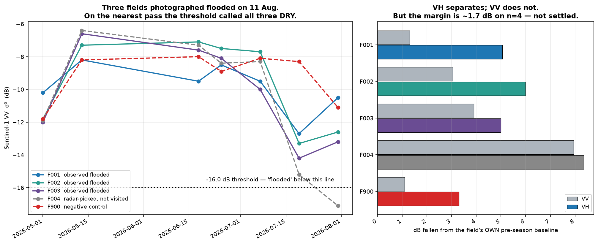

# Paddy Water & Methane Tracker

**Using free satellite radar to work out when rice fields are flooded, and what that
costs the climate.**

East Godavari delta, Andhra Pradesh, India.

> **Status: in build, week 1.** Nothing here is decision-grade. The most recent result
> is a *failure* of the first method, documented below — see
> [What we found on 11 August](#what-we-found-on-11-august-the-first-real-result).

---

## For a reader who is not technical

**The problem.** Rice is grown in flooded fields. Under water, the soil runs out of
oxygen, and the bacteria that take over release **methane** — a greenhouse gas about 27
times stronger than CO₂ over a century. Rice paddies are roughly **8% of all
human-caused methane**.

**The fix already exists.** If a farmer lets the field dry out once or twice mid-season
instead of keeping it flooded throughout — a practice called **Alternate Wetting and
Drying**, or AWD — methane drops sharply. Yield usually holds. Less pumping, so the
farmer's electricity bill drops too.

**So why isn't everyone doing it?** Partly because **nobody can prove it happened.**
Carbon credit programmes need evidence that a field was actually dried. Sending someone
to walk 10,000 fields is impossible. Asking farmers to remember last July is unreliable.
Without proof, there is no payment, and without payment there is much less reason to
change.

**What this project tries to do.** Watch the fields from space instead.

```
   satellite radar  →  when was this field under water?
                    →  how much methane did that produce?
                    →  what would drying it twice have saved?
```

**Why radar and not a normal camera.** This is monsoon country. An ordinary satellite
photo would show clouds for most of the growing season. **Radar makes its own signal and
goes straight through cloud**, day or night. The satellite is Sentinel-1, run by the
European Space Agency. The data is free and public.

**How radar sees water.** Radar sends a pulse down and listens for the echo. Still water
acts like a mirror — the pulse skids off sideways and never comes back. So **flooded
ground shows up dark**. Dry, rough ground scatters the pulse in all directions, some of
it back up to the satellite, so it shows up bright.

That is the whole idea. Watch a field go dark and bright across the season, and you have
its water diary without anyone standing in it.

**It is more complicated than that**, and this repository is partly a record of finding
out how. Keep reading.

---

## What we found on 11 August — the first real result

On 11 August 2026 we walked into the paddy block near Sarpavaram and photographed three
fields. All three clearly held **transplanted rice standing in water**.

Then we asked the satellite what it thought.



**The satellite said all three were dry.** Zero out of three.

### Why it failed

The "water is a mirror" rule is true — for **bare** water. But these fields had rice
stems sticking up out of the water. The radar pulse hits the water, bounces sideways
into a stem, and comes **straight back up** to the satellite. The field reads *brighter*,
not darker. This is called **double-bounce**, and it means a fixed brightness threshold
only works during the short window between flooding a field and the seedlings growing
tall enough to matter.

### What looks more promising

Instead of asking *"is this field darker than a fixed line?"*, ask *"**how much darker
has this field become compared to its own dry season?**"* Every field then gets judged
against itself, which removes the differences between fields that a single global
threshold cannot handle.

Measured against a two-pass pre-season baseline:

| Field | Observed | VV drop | **VH drop** |
|---|---|---|---|
| F001 | flooded | 1.3 dB | **5.1 dB** |
| F002 | flooded | 3.0 dB | **6.0 dB** |
| F003 | flooded | 3.9 dB | **5.0 dB** |
| F004 | not visited | 8.0 dB | **8.4 dB** |
| F900 | **not** paddy | 1.1 dB | **3.3 dB** |

The second radar channel (**VH**) separates flooded fields from the non-paddy control;
the first (VV) does not. But the gap between the weakest real field (5.0 dB) and the
control (3.3 dB) is only **1.7 dB**, on a sample of four fields with one control.

**That is suggestive, not proven.** It is written down here so that if it falls apart on
a bigger sample, the record shows what was claimed and when.

Raw numbers: [`data/validation/2026-08-11-first-ground-check.csv`](data/validation/2026-08-11-first-ground-check.csv).
Chart code: [`src/visualization/plot_validation.py`](src/visualization/plot_validation.py).

---

## What has actually been built so far

| | Status |
|---|---|
| Study area fixed to the real villages | done |
| Satellite pass calendar, derived not assumed | done — every 12 days, 05:52 IST, orbit 19 |
| Download + cache layer (fetch once, never re-fetch) | done |
| Sentinel-1 backscatter per field, per pass | done |
| First ground-truth trip, 19 photos | done — 11 Aug 2026 |
| First validation of satellite vs reality | done — **and the method failed** |
| Flood classification that survives contact with reality | **in progress** |
| Methane model (IPCC 2019 Tier 2) | not started |
| AWD comparison | not started |
| Web app | not started |

### Three bugs found along the way

Each one produced believable but wrong numbers, silently. They are worth listing because
"the code ran without an error" is not the same as "the answer is right".

1. **Mosaic ordering.** One satellite pass arrives as several overlapping strips. Loaded
   in the order the catalogue happened to return them, the later strip's empty pixels
   painted over the earlier strip's real data — **93% of the study area was blanked, with
   no error raised.** Fixed by sorting on acquisition time, plus an assertion that fails
   loudly if it ever comes back.

2. **Averaging decibels.** Radar brightness is measured on a logarithmic scale.
   Averaging those numbers directly is arithmetically wrong. Two pixels at −20 dB and
   −5 dB average to −12.5 dB the wrong way and −7.9 dB the right way. That 4.6 dB gap
   straddles the flood threshold.

3. **Guessing the revisit interval from the shortest gap.** A satellite handover on
   25 June 2026 produced a one-off 7-day gap. Taking the minimum would have projected a
   7-day calendar and wasted real field trips. The correct answer is the **mode**: 12 days.

---

## What happens next

| When | What |
|---|---|
| **Next** | Second ground check on the 12 Aug pass — a **one-day** gap between photo and satellite, the tightest validation available |
| Then | Rebuild flood detection around baseline-drop and VH, and re-test it against the photos |
| Then | Draw 10–15 field boundaries and run the whole season through |
| Then | IPCC Tier 2 methane per field, as a range not a single number |
| Then | AWD comparison — methane avoided, water saved, pumping cost saved |
| Then | Mobile web app, Telugu and English |

---

## Honesty rules this project runs on

- **Report what was measured.** An honest 71% agreement beats a flattering 95%. The rows
  where satellite and ground disagree are the most valuable rows in the table.
- **Flag, don't fudge.** When the radar becomes unreliable, mark the reading
  low-confidence. Never quietly shift a threshold to make a curve look right.
- **Every number carries its uncertainty.** The methane emission factor has a published
  range, so the methane figure is a band, not a point.
- **Drying events are a lower bound.** A 12-day revisit cannot see a drying event
  shorter than 12 days. This biases the estimate *upward*, which is the safe direction.
- **Nobody gets paid for carbon from this.** It is a portfolio project. It is not
  agronomic advice, and it does not tell anyone to drain a field — AWD done wrong costs
  yield.

### Anonymised from the first commit

Farmers appear as `F001`, `Farmer 1`. **No names, no survey numbers, no phone numbers,
ever, in any tracked file.** Real field boundaries, interview notes and photographs live
in `data/fields/`, which is gitignored for privacy rather than for size. Published
coordinates are jittered.

---

## For developers

Cookiecutter Data Science layout. conda, **conda-forge only** — mixing channels is the
quickest route to a `rasterio` that imports and then segfaults.

```bash
conda env create -f environment.yml
conda activate varaha

python -m src.config                      # print resolved config, create dirs
python -m src.data.overpass               # next Sentinel-1 pass dates
python -m src.visualization.plot_validation   # regenerate the chart above
```

```
src/
  config.py            every path, CRS, threshold and constant. no magic numbers elsewhere
  data/                fetchers + cache. nothing here computes features
  features/            flooding classification, season metrics
  models/              IPCC, methane, water/cost
  visualization/       plots
data/
  raw/ interim/ processed/   gitignored, re-fetchable
  fields/                    boundaries + interviews. gitignored for PRIVACY
  validation/                tracked — accuracy claims need visible rows
backend/               FastAPI, read-only
frontend/              Vite + React + TypeScript
```

**The two-CRS rule.** `EPSG:4326` stores and displays; `EPSG:32644` (UTM 44N) measures.
Every area, distance and buffer goes through the projected CRS. Area computed in degrees
is wrong by about 1.2 × 10¹⁰ on a real field here.

Conventions, and the full list of traps that silently produce plausible wrong answers,
are in [`CLAUDE.md`](CLAUDE.md).

### Read these

| File | What it gives you |
|---|---|
| [`explanation.md`](explanation.md) | The whole idea in plain language |
| [`docs/00-project-explainer.md`](docs/00-project-explainer.md) | Long-form walkthrough |
| [`docs/03-methane-model.md`](docs/03-methane-model.md) | Every IPCC constant with its table reference |
| [`docs/02-field-visit-kit.md`](docs/02-field-visit-kit.md) | Consent script, questions, boundary procedure |

---

## Data sources

All free, all public, no API keys.

| Source | Used for |
|---|---|
| Sentinel-1 (ESA, via Microsoft Planetary Computer) | radar backscatter — the water signal |
| Sentinel-2 (ESA) | optical NDVI — crop growth, cloud permitting |
| IPCC 2019 Refinement, Vol. 4 Ch. 5 | methane emission factors and scaling factors |

---

## Roadmap

| | |
|---|---|
| **v1** | This. 10–15 fields, deployed, validated against photographs. |
| **v2** | Trained classifier using ground-truth labels; a few hundred fields; multi-season. |
| **v3** | Farmer-facing loop — confirm or correct what the satellite saw, in the app. The growing ground-truth dataset is the asset nobody can copy. |
| **v4** | Soil carbon (RothC). |
| **v5** | Project-level aggregation with uncertainty, in the shape a registry expects. |
